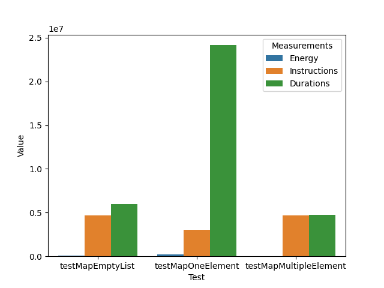
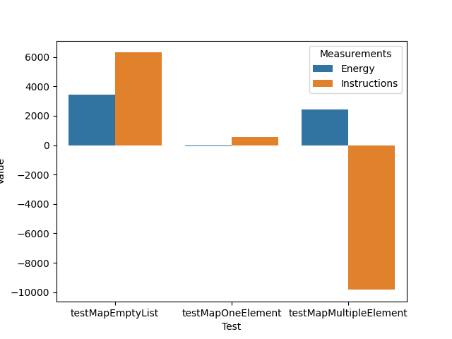

# Diff-Jjoules Demo

This project aims at showing how Diff-JJoules works and what can be done.

## Diff-JJoules

Diff-JJoules aims at measuring the impact of code changes (commit) on energy consumption.

The algorithm is as follow : 

1. Clone twice the project
2. Each clone is set to a specific version, for example two sucessive commits
3. Execute the tests on the two versions and select the tests as follow :
    * Select the tests in the version before the commit that execute the lines that have been removed by the commit
    * Select the tests in the version after the commit that execute the lines that have been added by the commit
4. Instrument the tests that have been selected with special annotations to measure the energy consumption of each test
5. Execute the test on the two versions

## Prerequisites

### Install JJoules

```sh
git clone https://github.com/Mamadou59/j-joules
cd j-joules
mvn clean install -DskipTests
```

### Install JUnit-JJoules

```sh
git clone https://github.com/davidson-consulting/junit-jjoules
```

Generate the shared library, by replacing `<absolute-path>` by the absolute path, and `<JAVA_HOME>` by your correct `JAVA_HOME`:

```sh
cd junit-jjoules/src/main/c
export JAVA_HOME=<JAVA_HOME>
make
LD_LIBRARY_PATH=<absolute-path>/junit-jjoules/src/main/c/lib/
export LD_LIBRARY_PATH
```

Then, install JUnit-JJoules:

```sh
cd ../../..
mvn clean install -DskipTests
```

### Install Diff-JJoules

```sh
https://github.com/davidson-consulting/diff-jjoules
cd diff-jjoules
mvn clean install -DskipTests
```

### Install DSpot-diff-test-selection

```sh
git clone https://github.com/STAMP-project/dspot.git
cd dspot
mvn clean install -DskipTests
```

### Install Untare-JJoules

```sh
git clone https://github.com/davidson-consulting/untare-jjoules.git
cd untare-jjoules
mvn clean install -DskipTests
```

### Set up permission to RAPL and perf_event

```sh
sudo chmod -R 777 /sys/devices/virtual/powercap/intel-rapl/intel-rapl:*
sudo -i
echo -1 > /proc/sys/kernel/perf_event_paranoid
```

### Configure Compilation for Warming up the JVM with Maven (Optionnal, slow down the demo)

```sh
export MAVEN_OPTS="-XX:CompileThreshold=1 -XX:-TieredCompilation"
```

## Demo

### Scenario

In this demo, the code changes is an artificial mutation:

```diff
public List<T> map(Function<T, T> operator) {
+   fr.davidson.diff_jjoules_demo.InternalList.consumeEnergy(10000L);
    final List<T> mappedList = new ArrayList<>();
    for (T t : this.internalList) {
        mappedList.add(operator.apply(t));
    }
    return mappedList;
}
+private static void consumeEnergy(final long energyToConsume) {
+   final org.powerapi.jjoules.EnergySample energySample = org.powerapi.jjoules.rapl.RaplDevice.RAPL.recordEnergy();
+   long random = 0L;
+   while (energySample.getEnergyReport().get("package|uJ") < energyToConsume) {
+       random += new java.util.Random(random).nextLong();
+   } 
+   energySample.stop();
+}
```

### Instrumentation Example

```diff
+@EnergyTest
-@Test
void testMapEmptyList() {
    final InternalList<Integer> emptyList = new InternalList<>();
    final List<Integer> map = emptyList.map(integer -> 2 * integer);
    assertTrue(map.isEmpty());
}
```

### Run 

To execute the demo, run the python script as follow:

```python
python3 src/main/python/demo.py
```

You should observe something like : 

```txt
                     Test  Value_n   Value_p Variation  Value_d_n  Value_d_p Variation_d       Measure
0        testMapEmptyList        0     67140   391.49%          0      66162     385.78%        Energy
1       testMapOneElement        0    220825   698.46%          0     211303     668.34%        Energy
2  testMapMultipleElement        0     32776   152.56%          0      35950     167.33%        Energy
3        testMapEmptyList        0   4677812   427.05%          0    4655486     425.01%  Instructions
4       testMapOneElement        0   2998825   103.21%          0    3037944     104.56%  Instructions
5  testMapMultipleElement        0   4671389   562.80%          0    4595422     553.65%  Instructions
6        testMapEmptyList        0   6002029   151.59%          0    5423796     136.98%     Durations
7       testMapOneElement        0  24148910   548.52%          0   23404691     531.62%     Durations
8  testMapMultipleElement        0   4776862   167.80%          0    4528222     159.07%     Durations
```

For each Measure : Energy (uJ), Instructions (#) and Durations (ns), this table gives for each unit test
(testMapEmptyList, testMapOneElement, testMapMultipleElement), the delta (v2 - v1). 
Value_n and Value_p are equals to delta or 0 depending on the sign of the delta (`< 0` for Value_n, and `> 0` for Value_p).
The variation is the proportion of the delta against the value of the v1 : (delta * v1) / 100.
This is done to reveal how much the commit impacts the indicators of the program.

In the folder `target/demo-output/` you can find all the data stored : for each version `v1` and `v2`, there is a folder.
Inside each folder `target/demo-output/v1` and `target/demo-output/v2`, there is one folder per iteration.
Inside each iteration folder, _e.g._ `target/demo-output/v1/1`, there are several json files that reports the value monitored by
`JJoules`.
Inside the folder `target/demo-output/`, there are also two histogram, such as the following :




That reports graphically the computed deltas. 
If the delta is negative, it means that v1 consumes more than v2 (because `v2 - v1 < 0, v2 < v1`).
If the delta is positive, it means that v1 consumes less than v2 (because `v2 - v1 > 0, v2 > v1`).